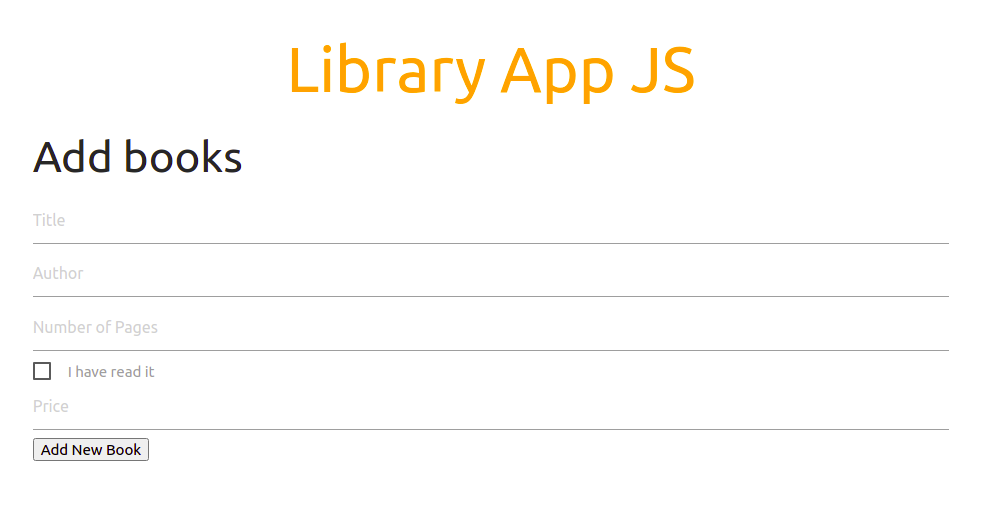

# Javascript Book Library App

This is a basic website project based on javascript, applying concepts of OOP: objects, functions, constructors, and two dimensions array to save objects. This objects are books with the parameters: title, author, number of pages, reading status, and price. Books can be added to the array, removed, and the reading status can be updated.

## Built With

- HTML5
- JavaScript
- Materialize-CSS

## Live Demo

[Live Demo Link](https://gonjavi.github.io/JavascriptLibrary/)

### Setup

 - Open with the browser or with liveserver

## Author

👤 **Gonza Javier Mancilla**

- Github: [@gonjavi](https://github.com/gonjavi)
- Linkedin: [@g-javier-mancilla](https://www.linkedin.com/in/g-javier-mancilla-a686a9178/)

## 🤝 Contributing

Contributions, issues and feature requests are welcome!

## Show your support

Give a ⭐️ if you like this project!

## 📝 License

This project is [MIT](lic.url) licensed.
